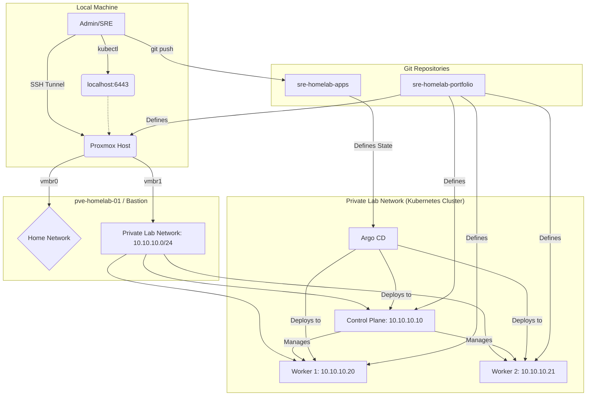

# SRE Home Lab: A Cloud-Native Platform Portfolio

This repository contains the infrastructure and configuration of a simulated production-grade Kubernetes platform, built entirely on **Site Reliability Engineering (SRE)**, **Infrastructure as Code (IaC)**, and **GitOps** principles.

This project is a **"Living Proof of Work"**, demonstrating the ability to build, automate, and operate a resilient and observable microservices ecosystem from scratch.

---

## Architecture

The platform is built in layers, from base virtualization to continuous application delivery. The diagram below illustrates the interaction between the main components:

---

## Technology Stack

* **Virtualization:** Proxmox VE
* **Infrastructure as Code (IaC):** OpenTofu
* **Configuration as Code (CaC):** Ansible (with Roles)
* **Container Orchestration:** K3s (Kubernetes)
* **Continuous Delivery (GitOps):** Argo CD

---

## Current State

* [✔] 3-node Kubernetes cluster (1 control-plane, 2 workers) fully operational.
* [✔] Infrastructure provisioning 100% automated with OpenTofu.
* [✔] Cluster configuration and K3s installation 100% automated with Ansible.
* [✔] GitOps platform with Argo CD installed and managing cluster state from the `sre-homelab-apps` repository.
* [✔] Secure remote access to Kubernetes API and nodes via Bastion Host and SSH tunnels.

---

## Getting Started: Interacting with the Lab

To interact with this platform, you need to configure secure access. The guides below contain all necessary instructions:

* **[Proxmox Template Guide](./docs/PROXMOX_TEMPLATE_GUIDE.md):** Create the required VM template for infrastructure provisioning.
* **[Network Architecture](./docs/NETWORK.md):** Understand the network topology.
* **[SSH Access Guide](./docs/SSH_ACCESS.md):** Configure your SSH client to access the nodes.
* **[`kubectl` Access Guide](./docs/KUBECTL_ACCESS.md):** Configure `kubectl` on your local machine to manage the cluster.

---

## Repository Structure

* `/terraform`: Contains all OpenTofu code to provision VM infrastructure.
* `/ansible`: Contains Ansible playbooks and roles to configure VMs and install K3s.
* `/kubernetes`: Contains Kubernetes bootstrap manifests (e.g., Argo CD root application).
* `/docs`: Contains all architecture documentation and operation guides.